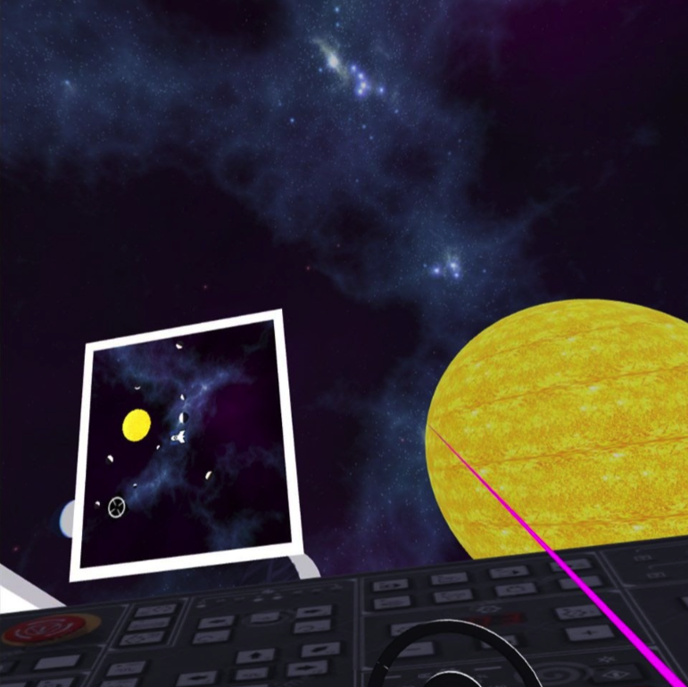

# Space Explorer VR  
A small fun game to get into VR, trying out the magic of VR to transport you into your imagination. In this case, space!

It comprises of 4 scences with 4 different missions: starting with flying your spaceship through the sun to reach the dropped cargos from a wrecked ship, then collecting your cargos floating around you. Then moving to the next scene where you collect tools from the cargo for the building mission. Lastly, you are in a greenhouse on Mars collecting stuffs and taking care of trees. Check out the demo video below.

# Scenes Instructions:
## SpaceshipScene (driving task):
- Player goes to the cockpit position, a minimap automatically turns on showing the location of the player. It shows the exact position of spaceship in the space.
- Controlling spaceship:
  - To steer left and right: rotating (rotating the wrists, not the thumbsticks) BOTH controllers to the right or left more than 20 degrees.
  - To accelerate and decelerate: pressing button “B” to accelerate and “A” to decelerate. 
- Player will drive the spaceship to the cargo to retrieve the packages, marked with symbol “white round cross” on the minimap.

  

## CargoScene (collecting floating packages task):
- The Spaceship is in front of the cargo with 4 floating boxes to be collected. 
- To get a package:
  - To retrieve a package, point the PRIMARY controller to the object and keep hitting the “trigger” button. The package will move step-by-step closer to the window. 
  - When hovering the pointer on the packages, the notification text notifies which package is selected.
- If the package is close enough to the spaceship, it will be collected, a notification will be shown in the Text field on canvas.

## ToolsRoomScene (collecting tools task):
- Mission: Collect 2 tools for further mission (hammer and saw).
- Put tools in the wooden box (wooden box automatically follows player). If the tools are dropped outside of the box, they return to the shelf.

## GreenHouseScene (complete 2 mission):
- Mission: 
Collect the 2 boxes lying around the room and put them at the corner of the greenhouse.
- Use the saw to cut off 3 unwanted palm-trees grown disorderly around the greenhouse. 
- Player can travel around the greenhouse with laser teleportation. Point the laser to the ground then hit “trigger”. Player will teleport to the exact point on the floor.
